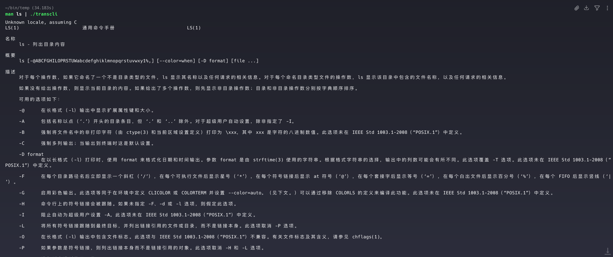

# Transcli

命令行AI翻译工具

# 安装
```shell
# mac系统通过浏览器下载会有权限问题，需要用 xattr -cr 命令去除标记。命令行通过 wget 下载不会有这个问题
wget <从Release list复制最新下载链接>
# 示例
wget https://github.com/yqy7/transcli/releases/download/v1.0.6/transcli-macos-latest-ARM64-v1.0.6.zip
# 解压
unzip transcli-macos-latest-ARM64-v1.0.6.zip
```

# 运行
需要先配置大模型 apikey，配置文件保存路径：~/.config/transcli/transcli.json
```shell
# 使用 vi 编辑配置文件
./transcli -c
```
配置文件示例（兼容OpenAI API）：
```
"usePager": true, // 可选，默认true，使用 less 显示结果
"llm": [
    {
        "baseUrl": "https://api.deepseek.com",
        "apiKey": "你的API_KEY",
        "model": "deepseek-v4-flash"
    }
]
```
使用示例：
```shell
# 直接翻译文本
./transcli "hello"

# 翻译其他命令的输出
man ls | ./transcli

# 手动输入要翻译的文本，输入之后需要换行，然后按 Ctrl+D 结束输入
./transcli
```
运行截图



